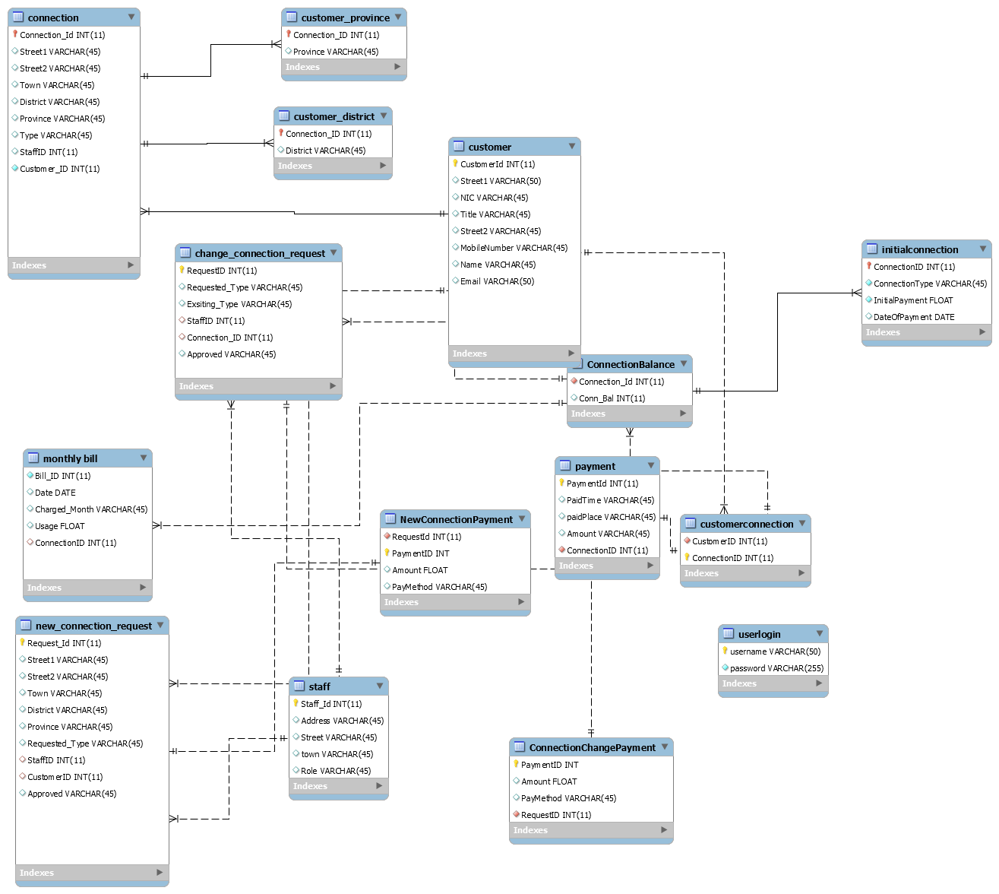

The “Ceylon Electricity Board Monitor” is a web-based system which helps people to monitor manage bill payments, handle new connection requests, handle connection change requests, etc. Different type of customers can access to web site as well as CEB employees will also have access as administrators.

Here is the database schema design.

